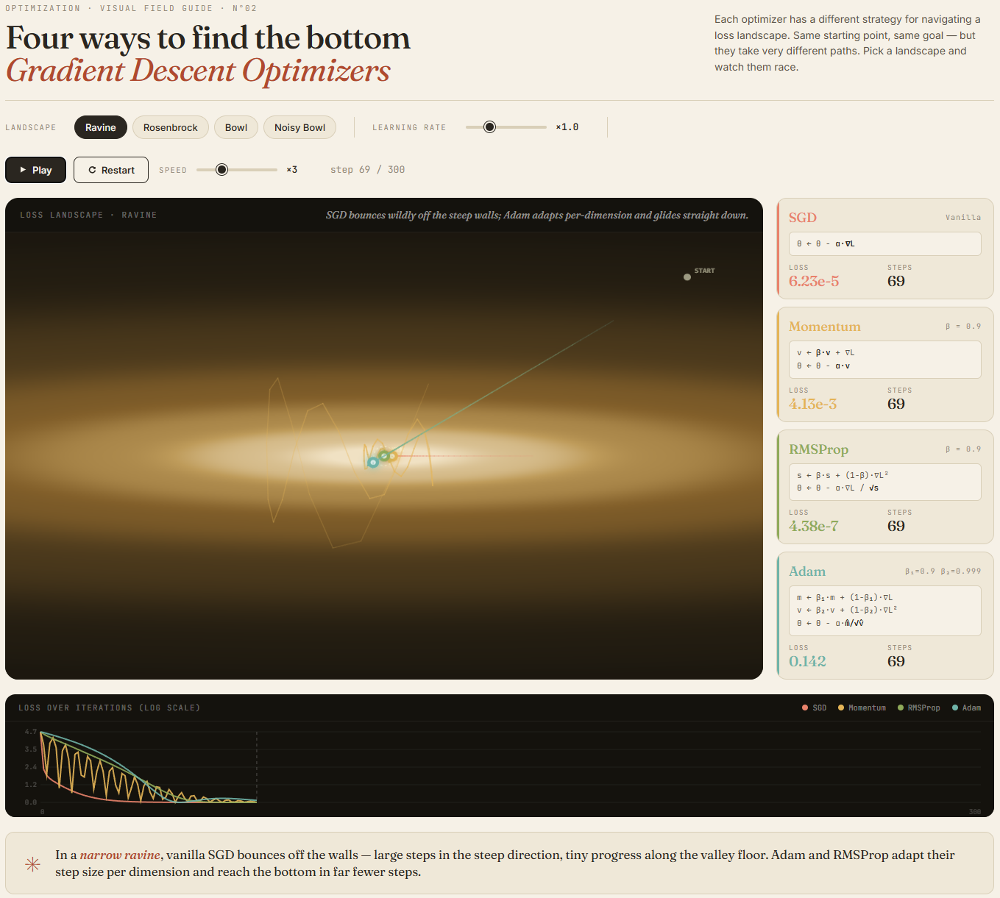

## 🚀 Live Demo  
👉 **[Try it here](https://nino-11.github.io/gradient-descent/)**

An interactive visualization that builds intuition for how different gradient descent optimizers behave on complex loss landscapes.

---

## Features

- Interactive comparison between SGD, Momentum, RMSProp, and Adam  
- Real-time parameter tuning (learning rate, speed, landscapes)  
- Visualization of optimization paths across different loss surfaces  
- Demonstrates convergence behavior, stability, and efficiency  

---

---

## Why this matters

Optimization is at the core of machine learning, but different optimizers behave very differently depending on the shape of the loss landscape.

This project highlights:

- Why vanilla SGD struggles in narrow or curved valleys  
- How Momentum accelerates convergence and reduces oscillation  
- How RMSProp adapts learning rates across dimensions  
- Why Adam is often more stable and efficient in practice  

---

## Tech

- HTML / JavaScript  
- Interactive data visualization (Canvas)  
- Client-side simulation (no backend)  
